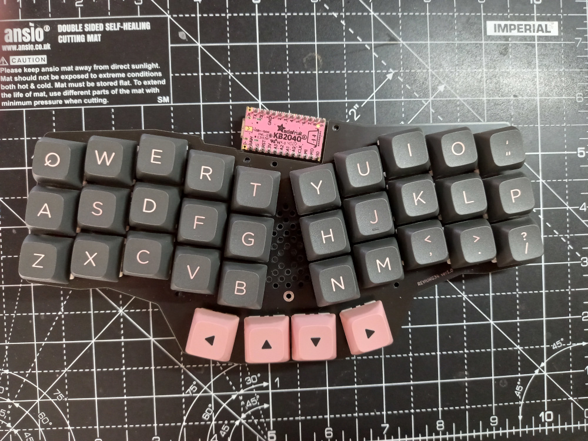
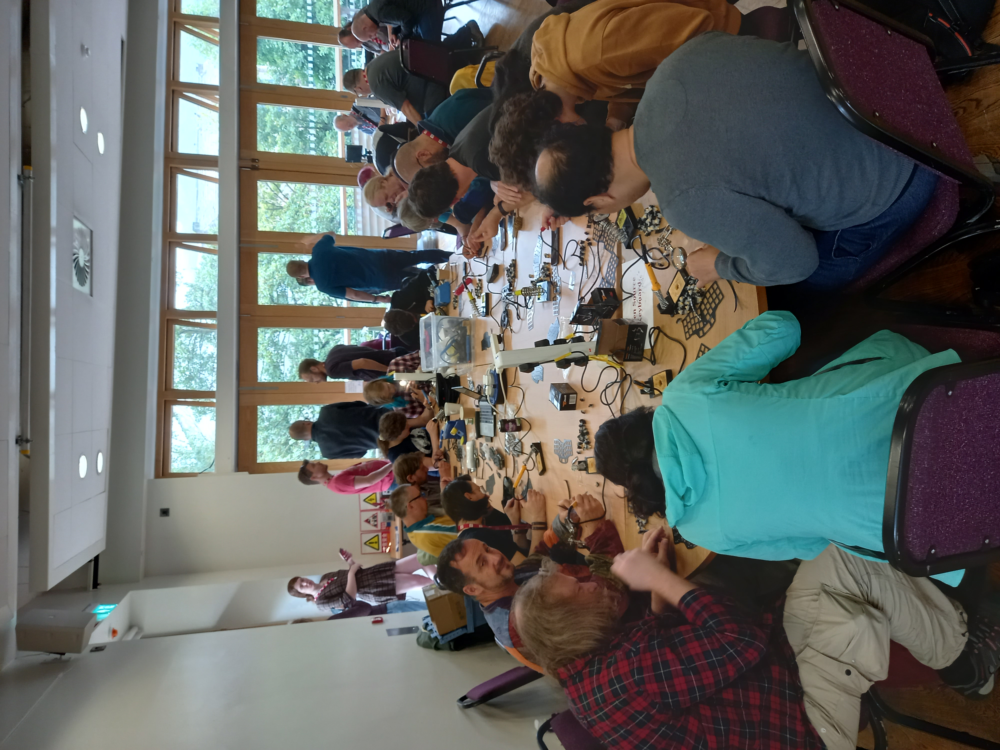
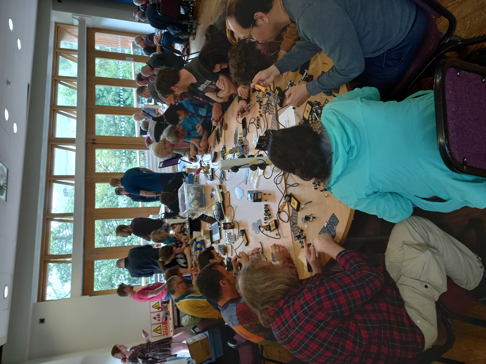
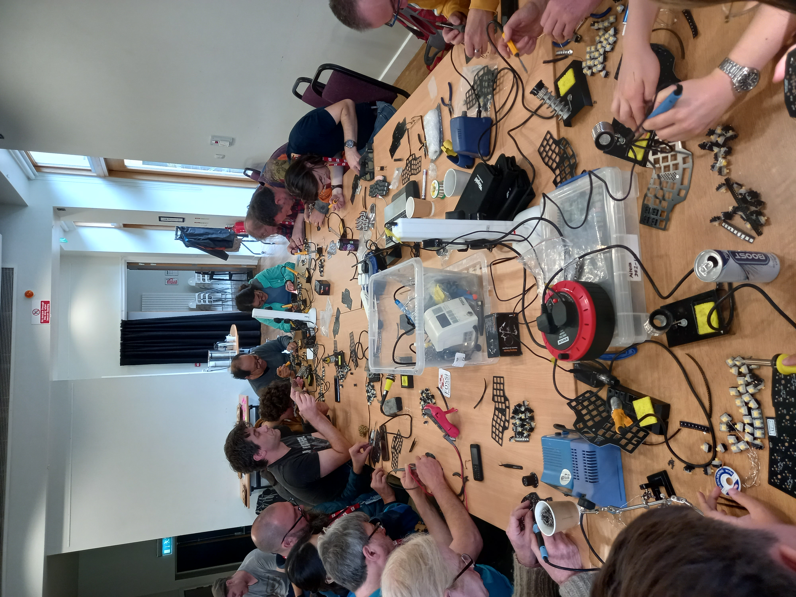

# OSHCamp 2023 Workshop - Build an OS Reviung34 Keyboard



[QMK Firmware](https://github.com/qmk/qmk_firmware)
follow the installation instructions in the repo, it does  install a lot of toolchains BTW!

[QMK Configurator layout](https://config.qmk.fm/#/reviung/reviung34/LAYOUT_reviung34)
download the layout and rename it to:
`qmk_firmware/keyboards/reviung/reviung34/keymaps/default_rgb/keymap.c`

Alternatively if you do not wish to change the layout you can just use the [keymap.c](./reviung34/keymap.c) in this repo

**Note:** *the default QMK Configurator layout uses the split version which is a little confusings. The 4 thumb keys are incorrectly ordered, have a play around you will see the difference.*


## Using the KB2040 as the ProMicro 
Make sure you power up the KB2040 over USB whilst holding the boot button to power it into boot loader mode
Build and flash the firmware:
```
qmk flash -kb reviung34 -km default_rgb -e CONVERT_TO=kb2040
```
This Builds and the loads the KB2040 version of the firmware

If you have any questions just create an issue on this repo.

## Here are some pics of the [OSHCAMP 2023](https://oshug.org/event/oshcamp2023) workshop:






