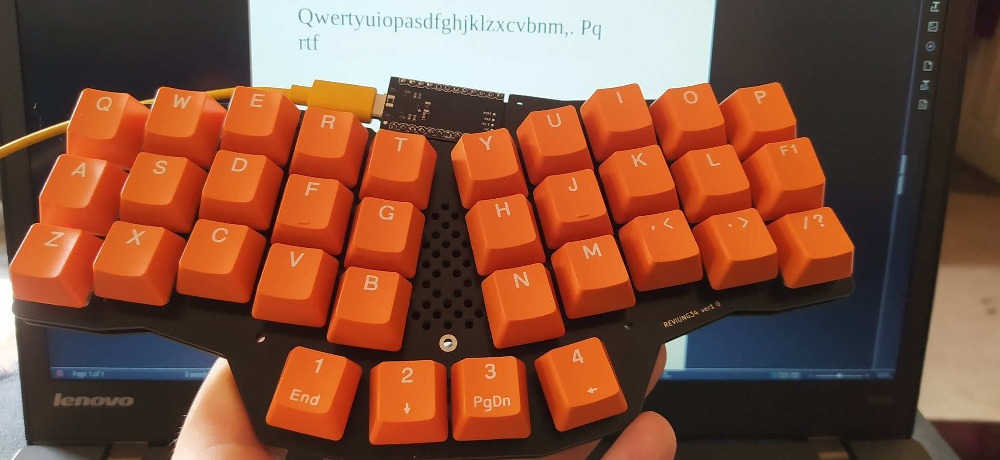
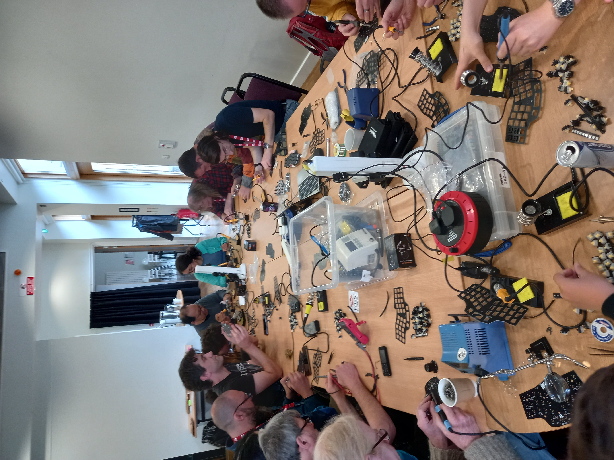
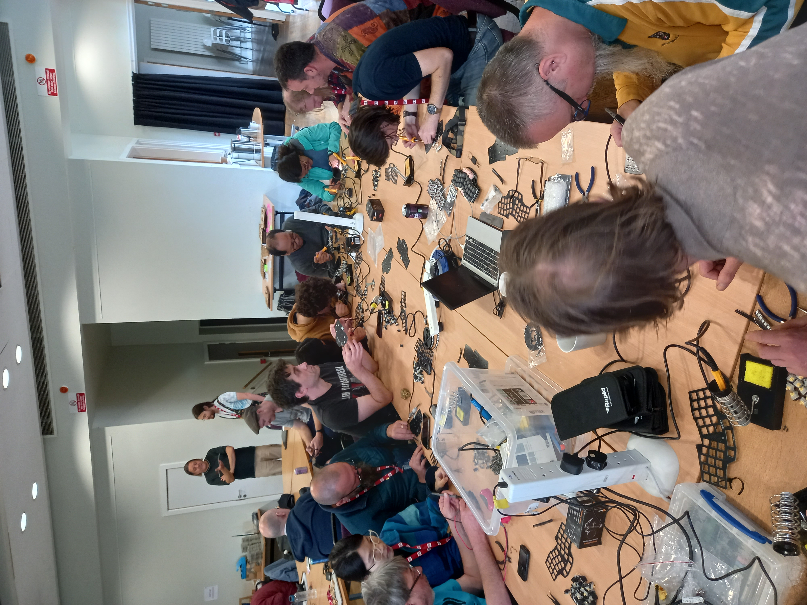

# OSHCamp 2023 Workshop - Build an OS Reviung34 Keyboard

The workshop gets participants to build a keyboard from the [Reviung](https://github.com/gtips/reviung) family called the [Reviung34](https://github.com/gtips/reviung/tree/master/reviung34)


[QMK Firmware](https://github.com/qmk/qmk_firmware)
follow the installation instructions in the repo, it does install a lot of tool-chains BTW!

[QMK Configurator layout](https://config.qmk.fm/#/reviung/reviung34/LAYOUT_reviung34)
download the layout and rename it to:
`qmk_firmware/keyboards/reviung/reviung34/keymaps/default_rgb/keymap.c`

Alternatively if you do not wish to change the layout you can just use the [keymap.c](./reviung34/keymap.c) in this repo

**Note:** *the default QMK Configurator layout uses the split keyboard version which is a little confusing. The 4 thumb keys are incorrectly ordered to the non-split version, have a play around after flashing it, you will see the difference.*


## Using the KB2040 as the ProMicro 
Make sure you power up the KB2040 over USB whilst holding the boot button to power it into boot loader mode
Build and  flash the firmware:
```
qmk flash -kb reviung34 -km default_rgb -e CONVERT_TO=kb2040
```
This Builds and the loads the KB2040 version of the firmware

If you have any questions just create an issue on this repo.

## Keyboard pics from workshop participants:
[Concrete dog's orange/black themed Reviung34](https://twitter.com/concreted0g/status/1696549243266150841) 


## Here are some pics of the [OSHCAMP 2023](https://oshug.org/event/oshcamp2023) workshop:






*Thank you to [SHMakerspace](https://www.shmakerspace.org/) for the loan of their soldering irons for the workshop*


